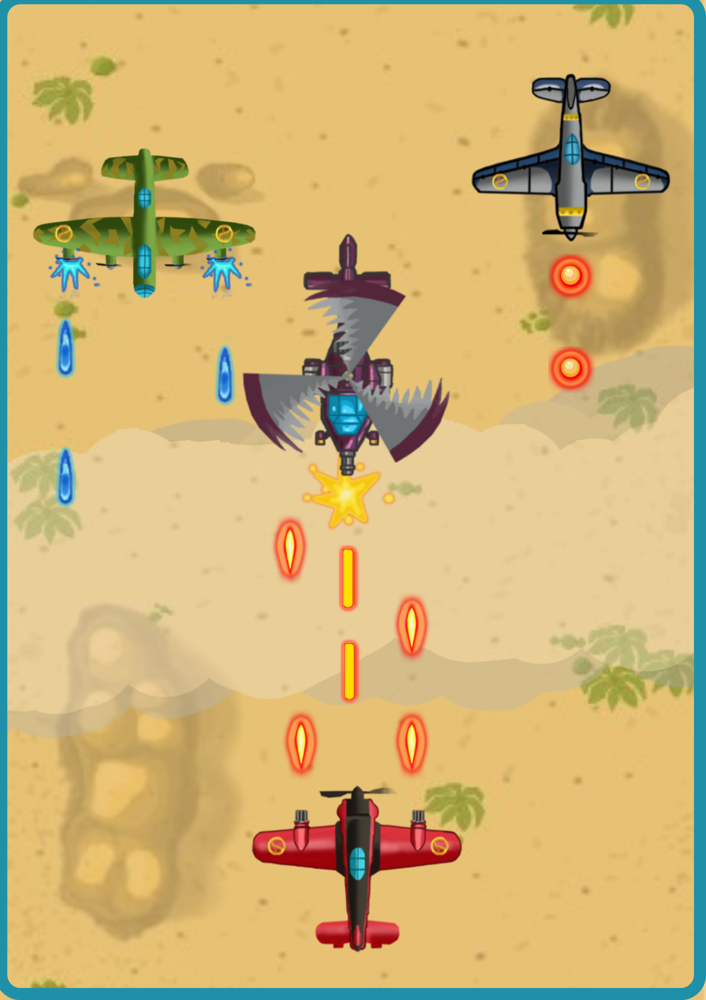

# 2D-Aeroblasters

Aeroblasters is a simple 2d vertical plane shooter game made using python and pygame. The game can  be run both on pc or android using pydroid3.


<p align='center'>
  
</p>

## Requirements

Use the package manager [pip](https://pip.pypa.io/en/stable/) to install following packages :-
* Pygame

```bash
pip install pygame
```

pygame is already installed in pydroid3, no installation required.

## Game Mechanics

### Objective

In Aeroblasters, you control a plane aiming to survive as long as possible while destroying enemy planes, avoiding their bullets, and collecting fuel and power-ups.

### Controls

- **Move Left**: `Left Arrow Key` or `Click/Tap` on the left half of the screen.
- **Move Right**: `Right Arrow Key` or `Click/Tap` on the right half of the screen.
- **Shoot**: `Spacebar` or `Click/Tap` on the plane.

### Gameplay

#### Player

- **Movement**: The player can move left or right within the screen bounds.
- **Shooting**: The player can shoot bullets to destroy enemy planes.
- **Health**: The player starts with 100 health points. Getting hit by enemy bullets or colliding with enemy planes reduces health. When health reaches 0, the player dies.
- **Fuel**: The player starts with 100 fuel points which deplete over time. Collecting fuel power-ups replenishes fuel. If fuel drops below -10, the game ends.
- **Power-ups**: Collecting power-ups allows the player to shoot multiple bullets simultaneously for a limited time.

#### Enemies

- **Types**: There are different types of enemy planes and choppers. Each has different health and shooting patterns.
- **Shooting**: Enemies shoot bullets that the player must avoid. Enemy bullets cause damage to the player upon collision.
- **Health**: Enemies have health points that decrease when hit by player bullets. Upon reaching 0 health, enemies explode.

#### Bullets

- **Player Bullets**: The player can shoot single or multiple bullets depending on collected power-ups. Bullets deal damage to enemies upon collision.
- **Enemy Bullets**: Enemies shoot bullets that damage the player upon collision.

#### Explosions

- Explosions occur when the player or enemies are destroyed. They are animated effects to indicate destruction.

#### Fuel and Power-ups

- **Fuel**: Fuel icons appear randomly and move downwards. Collecting them replenishes the player's fuel.
- **Power-ups**: Power-up icons also appear randomly and grant the player temporary abilities to shoot multiple bullets.

#### Scoring

- The player's score increases over time based on survival duration and the number of enemies destroyed.

### Levels

- The game increases in difficulty with each level, introducing more challenging enemies and more frequent attacks.

## Objects and Methods 

### Background
**Class:** `Background`

**Description:** 
Handles the background image, including its movement to create a scrolling effect.

**Methods:**
- `__init__(self, win)`: Initializes the background.
- `update(self, speed)`: Updates the position of the background images.
- `reset(self)`: Resets the background position.

### Player
**Class:** `Player`

**Description:** 
Manages the player's character, including movement, animation, and health.

**Methods:**
- `__init__(self, x, y)`: Initializes the player.
- `reset(self, x, y)`: Resets player attributes.
- `update(self, moving_left, moving_right, explosion_group)`: Updates the player's position and checks for health status.
- `draw(self, win)`: Draws the player on the screen.

### Enemy
**Class:** `Enemy`

**Description:** 
Represents the enemy characters in the game, including movement, shooting, and health.

**Methods:**
- `__init__(self, x, y, type_)`: Initializes the enemy.
- `shoot(self, enemy_bullet_group)`: Handles enemy shooting.
- `update(self, enemy_bullet_group, explosion_group)`: Updates enemy position, health, and shooting behavior.
- `draw(self, win)`: Draws the enemy on the screen.

### Bullet
**Class:** `Bullet`

**Description:** 
Represents bullets fired by the player and enemies.

**Methods:**
- `__init__(self, x, y, type_, dx=None)`: Initializes the bullet.
- `update(self)`: Updates the bullet's position.
- `draw(self, win)`: Draws the bullet on the screen.

### Explosion
**Class:** `Explosion`

**Description:** 
Handles the explosion animations when enemies or the player are destroyed.

**Methods:**
- `__init__(self, x, y, type_)`: Initializes the explosion.
- `update(self)`: Updates the explosion animation.
- `draw(self, win)`: Draws the explosion on the screen.

### Fuel
**Class:** `Fuel`

**Description:** 
Represents fuel power-ups that the player can collect.

**Methods:**
- `__init__(self, x, y)`: Initializes the fuel power-up.
- `update(self)`: Updates the position of the fuel power-up.
- `draw(self, win)`: Draws the fuel power-up on the screen.

### Powerup
**Class:** `Powerup`

**Description:** 
Represents power-up items that enhance the player's abilities.

**Methods:**
- `__init__(self, x, y)`: Initializes the power-up.
- `update(self)`: Updates the position of the power-up.
- `draw(self, win)`: Draws the power-up on the screen.

### Button
**Class:** `Button`

**Description:** 
Creates and manages interactive buttons in the game.

**Methods:**
- `__init__(self, img, scale, x, y)`: Initializes the button.
- `update_image(self, img)`: Updates the button's image.
- `draw(self, win)`: Draws the button on the screen and checks for clicks.

### Message
**Class:** `Message`

**Description:** 
Handles displaying text messages on the screen.

**Methods:**
- `__init__(self, x, y, size, text, font, color, win)`: Initializes the message.
- `update(self, text=None, shadow=True)`: Updates and draws the message on the screen.

### BlinkingText
**Class:** `BlinkingText`

**Description:** 
Displays blinking text messages on the screen.

**Methods:**
- `__init__(self, x, y, size, text, font, color, win)`: Initializes the blinking text.
- `update(self)`: Updates and draws the blinking text on the screen.
